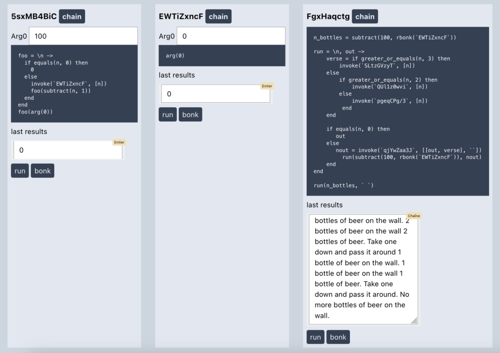

# Ovo

## This Ovo version is deprecated - a cleaned up implementation will soon be available :-\)

**Ovo is a small toy/side-project language**

Ovo is hosted by Elixir.
It is a reimplementation from scratch of a previous (private) implementation in typescript, and has nothing in common anymore with the previous implementation.

## Goals

- [x] Tokenizing, parsing, printing, running programs
- [x] Visual editor with LiveView .. well.. sort of

## The playground

Ovo can be used in a playground, which is a Liveview app allowing for visual edition of Ovo programs, runner registration, chains of runners, manual stacks shakeing, and orchestration of the execution of Ovo programs.



Complex programs are made possible due to Ovo's capabilities (detailed below), forming the Ovo Optimal Personal System (oops).

## Current state

Ovo in its current state is capable of correctly running this input :

```elixir
fibs = !\\a ->
  if greater_or_equals(a, 2) then
    add(fibs(subtract(a, 1)), fibs(subtract(a, 2)))
  else
    1
  end
end

fibs(10)

add(shake(fibs), shake(fibs))
```

Which returns `123` (the addition of fibs(10), 89 and fibs(8), 34).

## State-of-the-art features

Besides being impractical, Ovo has two distinguishing features : `shakes` and the ability to be ran as a global stateful system.

### shake

The `shake` feature in ovo works with lambdas that have been declared with a `!` before their argument list.  
A regular lambda is  `\a -> add(a, 1) end`, whereas a shakeable lambda is `!\a -> add(a, 1) end`.  
A shakeable lambda pushes its results in a stack, like this :  

```elixir
add_one = !\a -> add(a, 1) end # a stack [] is created
add_one(1) # produces the value 2, stack is [2]
add_one(3) # produces the value 4, stack is [4, 2]
```

Calling `shake` on a shakeable lambda pops a value from its stack.  

```elixir
add_one = !\a -> add(a, 1) end # a stack [] is created
add_one(1) # produces the value 2, stack is [2]
add_one(3) # produces the value 4, stack is [4, 2]
shake(add_one) # produces the value 4, stack is [2]
shake(add_one) # produces the value 2, stack is []
shake(add_one) # to this day, returns :error which isn't an ovo-compatible value
```

You can imagine things like :  

```elixir
add_one = !\\a -> add(a, 1) end
add_one(1)
add_one(3)
add_one(4)
a = shake(add_one)
shake(add_one)
add(a, shake(add_one))
```

### A global stateful system

You can run Ovo programs as shown above, by writing code and calling `Ovo.run/2` with your code and some input. But you can also run programs as independent `Runners` inside a stateful system, like so :

```elixir
# Start an Ovo.Registry
Ovo.Registry.start()
# Start some Ovo.Runners
{:ok, ovo_adder} = Ovo.Runner.register("""
add(arg(0), arg(1))
""")
{:ok, ovo_times2} = Ovo.Runner.register("""
multiply(arg(0), 2)
""") # ovo_times2 is 0ceaimhlh, which is this runner's ID and this program's hash
```

You can then call those runners with input :

```elixir
Ovo.Runner.run(ovo_adder, [2, 3]) # %Ovo.Ast{value: 5}
Ovo.Runner.run(ovo_times2, [5]) # %Ovo.Ast{value: 10}
```

You can also chain calls to programs, by giving their hashes to the registry, like so :

```elixir
Ovo.Registry.run_chain([ovo_adder, ovo_times2], [2, 3]) # %Ovo.Ast{value: 10}
```

If you know some program's hash (which is deterministic), you can also call it from another program with `invoke/2` :

```elixir
{:ok, dependent_program} = Ovo.Runner.register("""
invoke(`0ceaimhlh`, [2])
""")

Ovo.Runner.run(dependent_program, []) # %Ovo.Ast{value: 4}
```

What's nice here is that noone can pull the rug from beneath you : since program hashes are deterministic from the serialized AST, a program cannot change its behavior without changing its hash (well, except for collisions).

*Of course*, you can also `shake` runners to get their previous execution result, which is popped from a stack. You are *of course* responsible for not shakeing a runner with an empty stack. shakeing a runner from its hash from within another ovo program is possible with `rshake/1`.

```elixir
Ovo.Runner.shake(dependent_program) #  %Ovo.Ast{value: 4}
Ovo.Runner.shake(dependent_program)
17:14:13.814 [error] GenServer Ovo.Registry terminating
** (FunctionClauseError) no function clause matching in anonymous fn/1 in Ovo.Registry.pop_result/1
```

## Frequently asked questions

- Q : I'm running this in production to allow high-level scripting for my organization's billing system. Can you provide  us some support ?  
A : Please never contact me again  
- Q : What's the use ?  
  A : *\<indistinct chatter\>*
